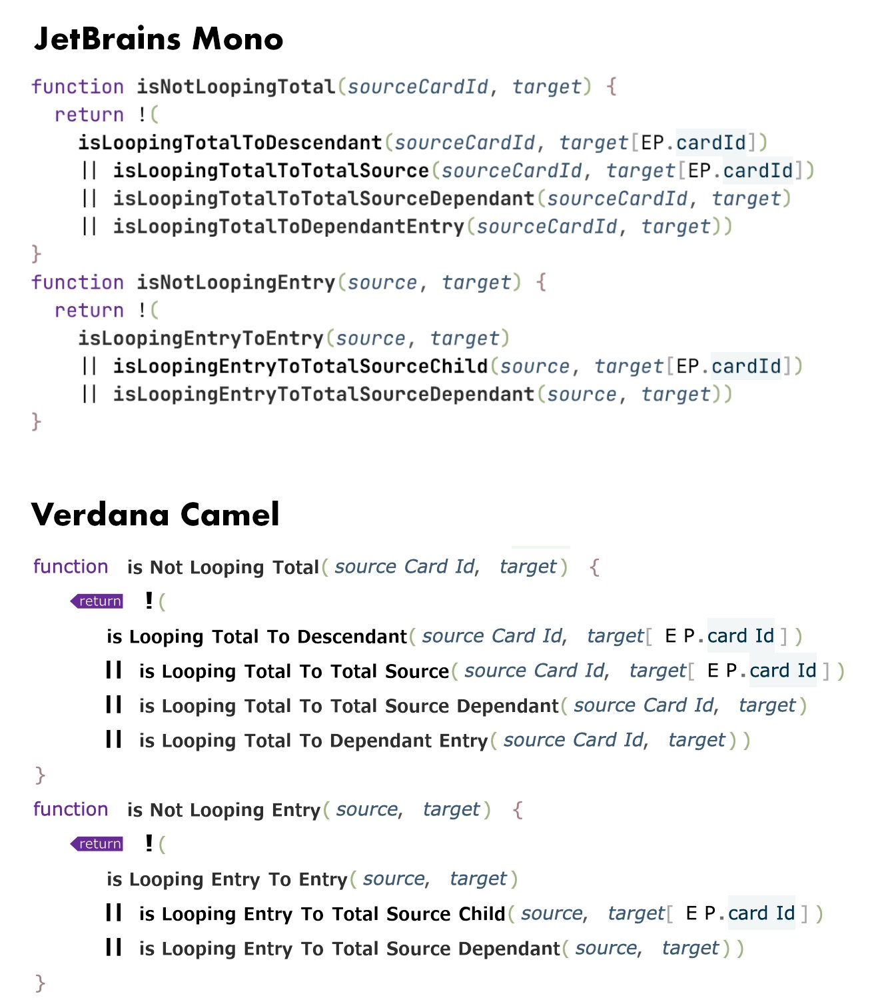

# VerdanaCamel

A proportional sans-serif font with extra left padding in capital case letters. And wider a space glyph.

Here’s a side-by-side with one of the most readable monospace typeface.

## To Do
- Remove the padding around `===` so it can be used for a solid long line
- Make `"` longer, so it's easier to read e.g. `'"foo"'`, also add more horizontal spacing.
- Larger return ligature
- Ligature for `>>=` `<<=` `+=` `-=` `*=`
- Ligature for `//` closer together
- Ligature for `...`
- Ligature for `../` (for directories ../../)
- Ligature for `()`
- Ligature for `export` (not so fancy as return but more visible)
- Ligature for `throw` (not so fancy as return but more visible)
- Ligature for `then` in the bold font (but to make lighter and thinner)
- Ligature for `this` (smaller)
- Ligature for `async` and `await` (maybe italic)
- More space around `/` for imports (bold and regular)
- More space around `.` (but not much more)
- More space around `(` and `)`
- More space before `M` 

## Other thoughts
- Try another font, because this one is too large (byte size). I guess it’s because I naively made the bold font by offsetting the normal one.
- Alternatively, in monospaced fonts, condense capital case letters.
 
 
Modified with [FontForge](https://fontforge.github.io/en-US/).
