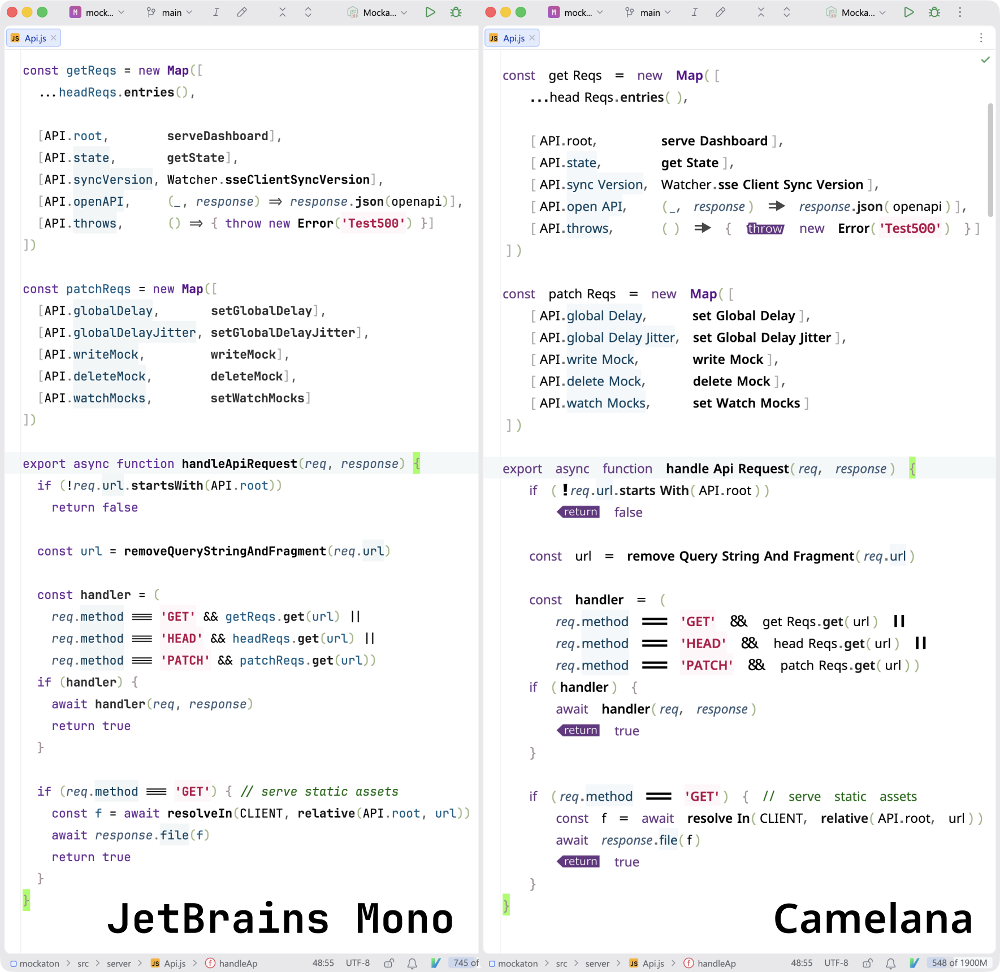
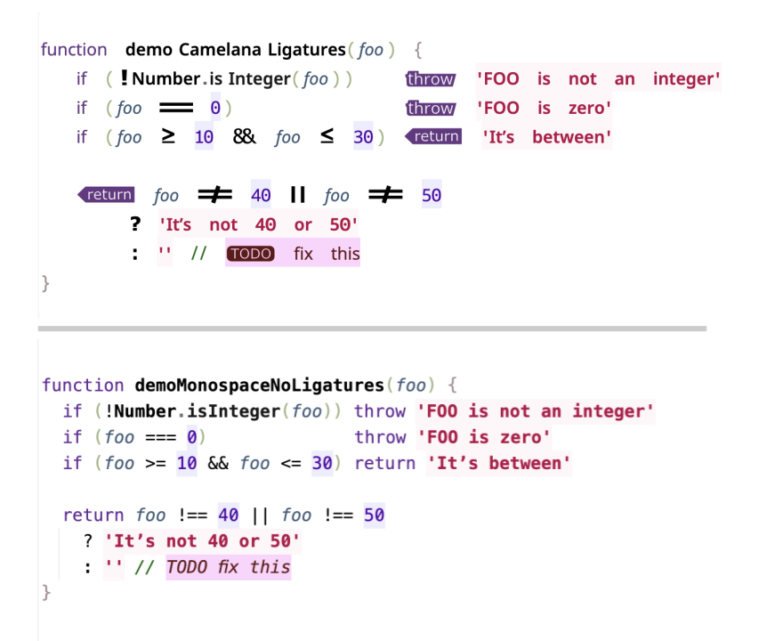

# Camelana (2026 Version)
Camelana is a proportional coding font.

Here‘s a side-by-side with one of the most legible monospace typeface.
The IDE on the picture uses [Tabular Eye](https://github.com/ericfortis/tabular-eye),
which renders code in columns without adding whitespace.

## Features
Besides common coding ligatures, this font has a little bit of left padding
on uppercase letters when they are part of a CamelCase identifier.
So to avoid confusion, the normal space glyph is much wider. It takes about
10 minutes to get used to that extra padding.

Also, `!`, `?`, and `:` are oversized so it's easier to spot them.
By the same token, `return`, `throw`, and `TODO` have a solid background. 

### Weights
- Regular (currently, this is the only weight with ligatures)
- Italic
- SemiBold
- SemiBoldItalic

### Release notes
- This new version is based on Noto Sans, which is nearly identical to Verdana.
- The `return` and the new `throw` ligatures are now context aware, so words such as `returned` don't get the replacement.
- The left padding on uppercase letters is now context aware, e.g., SCREAMING_CASE identifiers don't get the replacement.
 
### Docs
The [docs/](/docs) folder explains how it was done.

---

## VerdanaCamel (2016 Version)

### Motivation
The code snippet above was the motivation behind the camelization kerning. 
The day I wrote that code I was tired enough to notice that I had to make 
an extra effort to read those camelCase names. So I tried all the fonts I 
had installed and Verdana stood out. Then, I tweaked the kerning until it 
was suitable for coding. The first version had very little left padding on
uppercase letters because I thought it would be confusing. But after a few 
minutes of using it I noticed I could increase it even more, provided the 
normal space glyph was wide enough.
